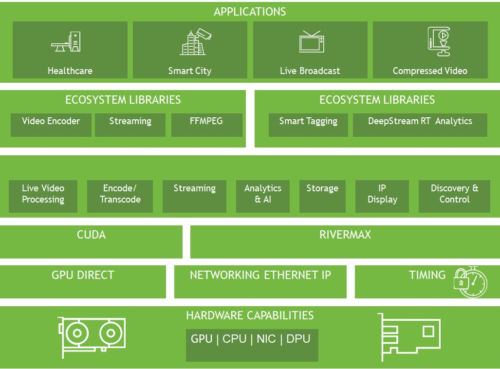

# NVIDIA Rivermax

## About This Repository

This repository serves as your central gateway to all NVIDIA Rivermax resources, code samples, tools, and applications. It provides a comprehensive overview and quick access to specialized repositories containing Rivermax implementations and examples.

## Introduction to Rivermax

NVIDIA® Rivermax® SDK -  Optimized networking SDK for Media and Data streaming applications.
Rivermax offers a unique IP-based solution for any media and data streaming use case. 
Rivermax together with NVIDIA GPU accelerated computing technologies unlocks innovation for a  wide range of applications in 
Media and Entertainment (M&E), Broadcast, Healthcare, Smart Cities and more.

Below you'll find links to specialized repositories containing the actual implementations and code samples commonly used by Rivermax customers and engineering teams.

The code in these repositories is provided As Is - tested only by the code owner and been tested before uploading with a specific hardware and software.

## NVIDIA Rivermax Repositories

- **[rivermax-dev-kit](https://github.com/NVIDIA/rivermax-dev-kit)** - High-level C++ SW kit designed to accelerate and simplify Rivermax application development with flexible IO nodes and developer-friendly services

- **[rivermax-examples](https://github.com/NVIDIA/rivermax-examples)** - Demo applications that demonstrate the usage of Rivermax API, provided as source code for reference

- **[rivermax-utils](https://github.com/NVIDIA/rivermax-utils)** - Utility scripts and tools for Rivermax

## Resources

### Official Documentation

- **[NVIDIA Rivermax Product Page](https://developer.nvidia.com/networking/rivermax)** - Official documentation, getting started guides, and SDK downloads
- **[NVIDIA Rivermax SDK Page](https://developer.nvidia.com/networking/rivermax-getting-started)** - SDK installation and platform support

## Support

- For SDK support and licensing: Contact NVIDIA through the [developer portal](https://developer.nvidia.com/networking/rivermax)
- For application issues: File issues in the respective GitHub repository
- For general questions: Visit the [NVIDIA Developer Forums](https://forums.developer.nvidia.com/)
